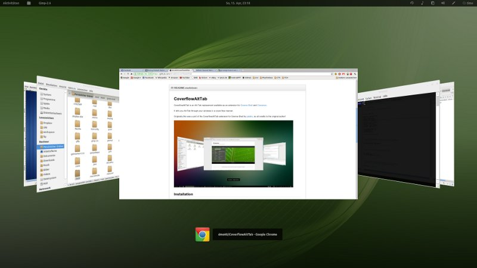

# CoverflowAltTab

<a href="https://extensions.gnome.org/extension/97/coverflow-alt-tab/"></a>
<a href="https://hosted.weblate.org/engage/coverflow-alt-tab/">
</a>

CoverflowAltTab is an Alt-Tab replacement available as an extension for [Gnome-Shell](https://www.gnome.org/). It lets you Alt-Tab through your windows in a cover-flow manner.



## Installation

Easiest way to install the extension is via [extensions.gnome.org](https://extensions.gnome.org/extension/97/coverflow-alt-tab/), the official Gnome extension platform. Head over there and install CoverflowAltTab with one click by toggling the switch on the site.

If you want to install it manually (e.g. to test the latest, probably unstable code):

1. Download the zip file by clicking the zip button on the upper part of this page and extract it (or you can just clone the repository).

2. Install the extension locally by running the following command in Terminal:

    - `make all`

## Usage
### Keybindings for System Actions
This extension uses the following system actions:

-   "Switch applications" (usually **Alt+Tab**): Cycle through windows grouped by application
-   "Switch windows" (usually undefined): Cycle through windows 
-   "Switch windows of an application" (usually **Alt+\`**): Cycle through all windows from the current application from all workspaces

#### Default and Recommended Shortcuts
Many users prefer a flat list of windows over a list grouped by application and so prefer the **Alt+Tab** key combination for "Switch windows". 
Such a user could change the keybindings as in the table:

| System Action       | Default Shortcut | Recommended Shortcut |
|---------------------|------------------|----------------------|
| Switch Applications | **Alt+Tab**      | **Super+Tab**        |
| Switch Windows      | None             | **Alt+Tab**          |

### Keybindings for Internal Actions
The extension adds its own internal actions which can be bound to other keyboard shortcuts. This could, for example, be useful if you want to sometimes use another window switcher that uses system actions bound to one set of shortcuts and use this extension that uses internal actions bound to a different set of shortcuts. 

Use the [preferences gui](#preferences-gui) to set the internal actions shortcuts. The internal actions correspond to the `Switch Windows` and `Switch Applications` system actions-- both system and internal `Switch Windows` and `Switch Applications` actions have the same effect to launch and cycle this extension.

All of the shortcuts with **Shift** key pressed cycles backward.

### Running Switcher Control
Keypresses can control the running switcher:
-   Hit **Esc** to cancel without picking a new window.
-   Hit **Return** to pick current window.
-   Hit **d** to hide all windows and show the desktop.
-   Hit **q** to close the current window (mostly works, might have some edge case bugs).

You can also use the **arrow keys**, **mouse wheel**, or **trackpad** to cycle through the windows.

### DBus

The extension exports a DBus interface. This can be used, for example, with the Custom Hot Corners - Extended extension to launch the switcher by moving to a corner.

The interface has four methods: 

1. The `launch` method which takes a string that should be either `windows` or `applications`

```
gdbus call --session --dest org.gnome.Shell.Extensions.Coverflowalttab --object-path /org/gnome/Shell/Extensions/Coverflowalttab --method org.gnome.Shell.Extensions.Coverflowalttab.launch "windows"
```

2. The `next` method which takes no arguments.
3. The `previous` method which also takes no arguments.
4. The `select` method breaks out of the switcher.


## Customization

### Keybinding Shortcuts
To change the system action shortcuts, use `gnome-control-center`.  To change the internal action shortcuts, use the [preferences GUI](#preferences-gui).

### Preferences GUI
To access preferences you can:

  - Open the Extensions tool. You should find it in your system menu
  - Click the preferences button on [extensions.gnome.org](https://extensions.gnome.org/local/)
  - run
```
gnome-extensions prefs CoverflowAltTab@palatis.blogspot.com
```

This will show you a preference dialog where you can change the settings to your needs.

## License

CoverflowAltTab is free software: you can redistribute it and/or modify it under the terms of the GNU General Public License as published by the Free Software Foundation, either version 3 of the License, or (at your option) any later version.

See the [contributors list](CONTRIBUTORS.md) and [a copy of the license](COPYING).
